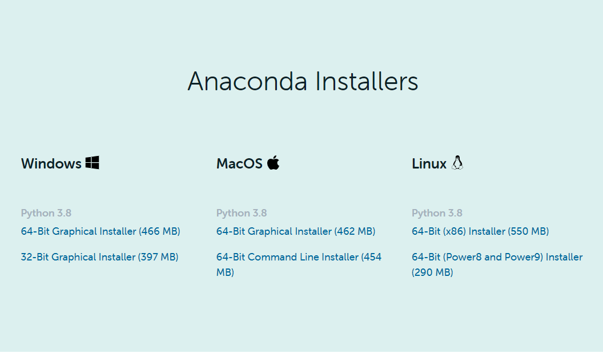
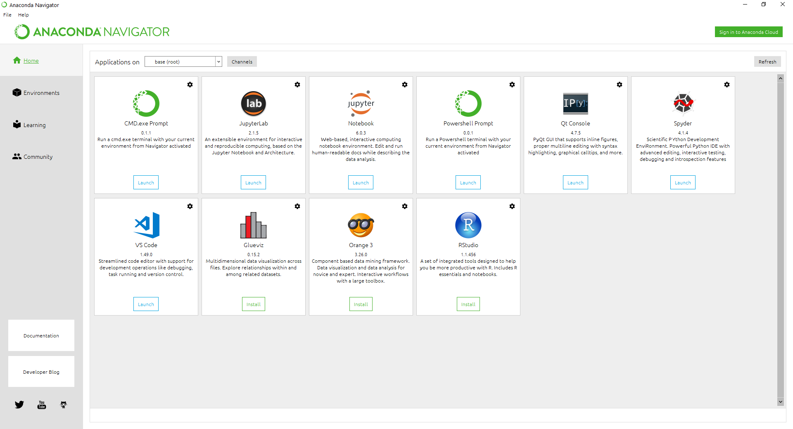
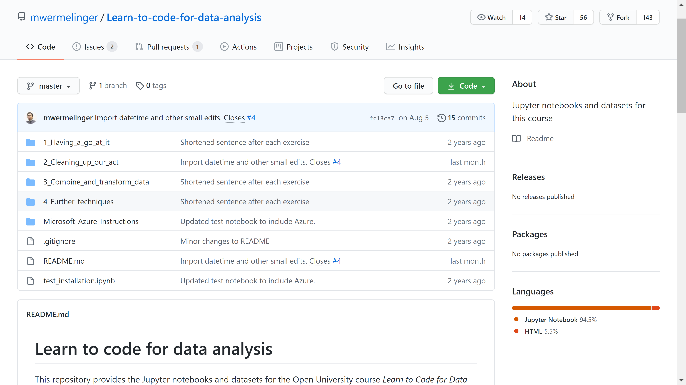
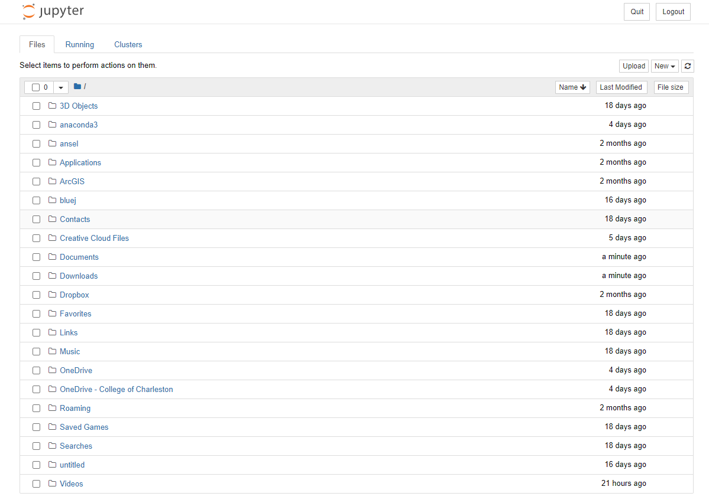
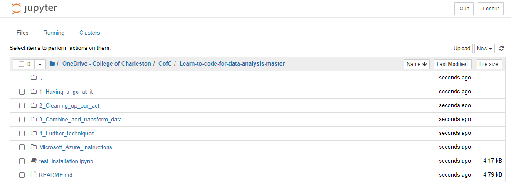
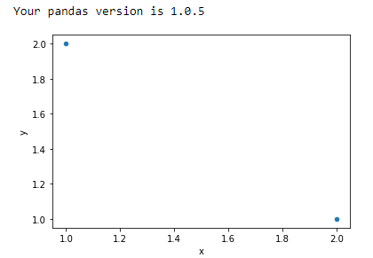

# Installing Anaconda

Visit [Anaconda's Download Page](https://www.anaconda.com/products/individual#windows) and download the appropriate version for your platform.

Then, open the Anaconda Installer downloaded and follow the instructions. Leave all settings in their default state. Or, feel free to research what each question is asking. These concepts will reappaear later if you pursue data-sci/comp-sci.

## Anaconda navigator
* **Jupyter Notebooks:** More user friendly, easy to follow. (recommended for this course)
* **Jupyter lab:** More complicated options and navigation experience. (not recommended unless you intend to dive deeper into the platform)

# Downloading the OpenLearn course files:

Go to the OpenLearn [Course Documents Page](https://github.com/mwermelinger/Learn-to-code-for-data-analysis). **Click the green "Code" button and select "Download Zip".**

Once downloaded, locate it in your computer's files and open the Zip File. Then select the "Learn-to-code-for-data-analysis-master" folder and copy it somewhere in your computer you would feel comfortable accessing it frequently (for me, the Documents folder works best).

# Finishing the installation:

We're nearly there! Now go back to Anaconda navigator and open Jupyter Notebooks. After a few moments, your internet browser should open to a webpage that looks like this.

*Fun fact, it's actually running on your computer, but looks like a webpage!*

Now, locate that folder you moved to somewhere convinient and open it. You should see this:

Once you've found your folder, open the test_installation.ipymb file. Finally, click on the cell that contains a bunch of code and click run. Your results should look like this:

***If everything went well, you're now ready to complete the exercises and projects necessary for OpenLearn. If not, feel free to email me and we can schedule a time to troubleshoot.***