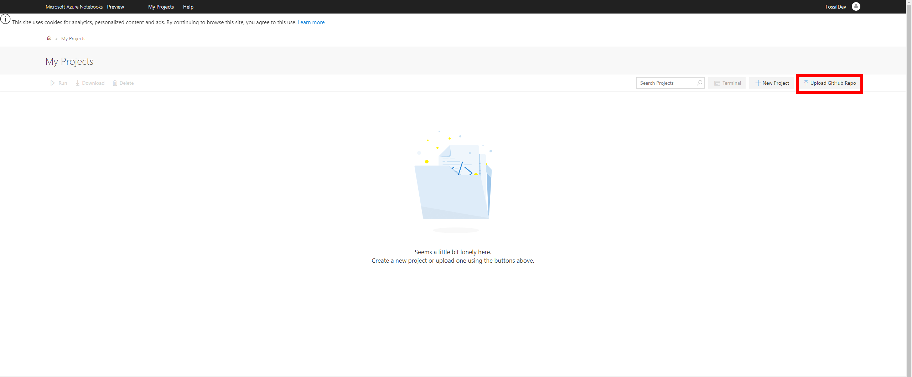
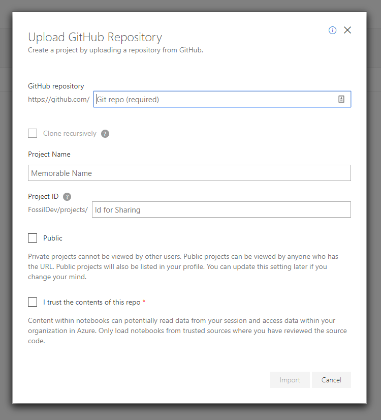

# Microsoft Azure Jupyter Notebooks Instructions (CofC Data 210)

Go to [Microsoft's Azure Notebooks Website](https://notebooks.azure.com/) and click 'sign in' at the top right corner.
Sign in using your cofc microsoft account.

In the 'My Projects' page (pictured), select the 'Upload GitHub Repo' option (highlighted in red).

### Upload GitHub Repository Window (Pictured):
* **GitHub Repository:** (`mwermelinger/Learn-to-code-for-data-analysis`) links to the *learn to code for data analysis* resources
* **Project Name:** For personal use
* **Project ID:** For personal use and sharing with mentors to troubleshoot code *(optional)*.
* **Public:** Must be public to share with Mentors/Instructor, can be changed at any time.

Import and you will be taken to your project files. Folders represent sections in the cirriculum.

Finally, open and run the test_installation file and ensure that you have no errors.